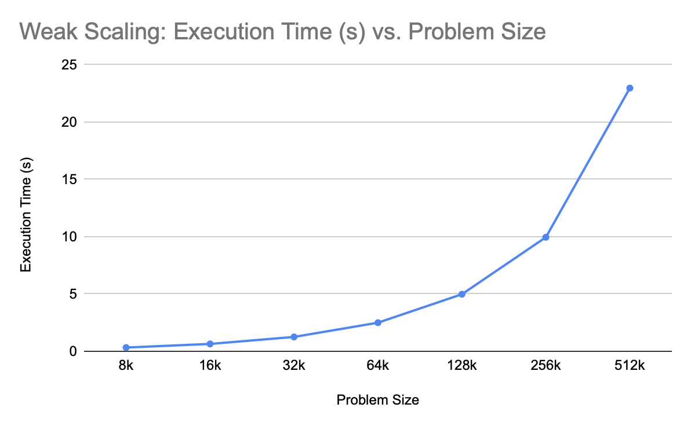

# ParallelComputing CSCE 435 Group project

## 1a. Group members:
1. Bora Oztekin
2. Phi Thuan Au
3. Yashas Salankimatt
4. Michael McKinsey

## 1b. Communication Method
- We will communicate via Slack.

---

## 2a. Project topic 
- We will be implementing the gradient descent algorithm in 2 versions and comparing them as discussed with Dr. Pearce in class. One implementation will use the CPU and MPI where the other implementation wil use the GPU and CUDA.

## 2b. Brief project description (what algorithms will you be comparing and on what architectures)
- Gradient Descent (on CPU using MPI)
- Gradient Descent (on GPU using CUDA)

## 2c. Brief Pseudocode

## 3. _due 11/12_ Pseudocode for each algorithm and implementation

### MPI

## 3. _due 11/12_ Evaluation plan - what and how will you measure and compare

### Cuda
- For evaluation of CUDA variant, we will have 3 different sizes of problems. For each problem size, we will measure runtime for 5 different values of number of threads (tentatively 32, 64, 128, 256, 512). We can then compare the runtimes as a function of thread count while keeping problem size constant and we can also compare runtimes as a function of problem size while keeping thread count constant.

### MPI
- We will evaluate the MPI implementation for a varying number of processors (2, 4, 8, 16, 32, 64). `MPI_Wtime()` timers will be added to measure time differences. We can then plot various metrics for time against amount of processors, including logistic regression training performance and worker communication performance.

## 4. _due 11/19_ Performance evaluation

Shown above is the graph of the runtime of the MPI variant, including sub-parts of the program as the number of processes is varied and problem size is kept constant.

Shown above is a graph varying number of threads running the problem vs the total runtime of the gradient descent CUDA problem as problem size is kept constant.

We can see from the two plots above, that in its current state, the MPI implementation is much faster than the CUDA implementation, but this is most likely due to the fact that the CUDA implementation times total runtime of the program and not just the processing time for the gradient descent. However, it can be seen in both plots that generally both implementations have a reduced runtime as the number of processes/threads is increased. It can also be seen that the MPI implementation has a much greater difference as number of processes is increased than the CUDA implementation, meaning that the CUDA implementation is not yet completely optimized.

## 5. _due 12/1_ Presentation, 5 min + questions

- Power point is ok

## 6. _due 12/8_ Final Report

### MPI

Seen above are the strong and weak scaling results for MPI gradient descent.
- **Strong Scaling:** Strong scaling results were performed on a dataset of 284,807 rows, 30 feature columns, and 1 label column. The most important detail to note for these set of graphs is that the number of processors includes the master process, which does not actually perform any computation for our implementation. This becomes critical when looking at the "Computation Time" graph, as we go from 1, 3, 7, 15, 31, 63 worker processes. Initial speedup looks good at first (x3), but falls off as worker processor size increases.
- **Weak Scaling:** Weak scaling results were based on giving every worker processor equal chunks of data. So one worker processor would recieve 4,500 rows and 3 would recieve 13,500 (4,500 each). This was done to emphasize the parallelism, and the results illustrate this, as "Computation Time" results did not slow down when adding more processors. The overall "Total Program Time" results would probably be better served on a larger data set, since for the used data set, the communication time dominates the computation time.  

Note: "Computation Time" results also include some communication, since a weight average and update between all workers is required after every epoch.

### CUDA

Seen above are the strong and weak scaling results for the CUDA implementation of gradient descent using one-layer logistic regression.
- **Strong Scaling:** Strong scaling results for CUDA were performed on a dataset of 16,000 samples, 4 feature columns, and 1 label column. As can be seen in the strong scaling graph above, the time to execution falls quite drastically until the 32 thread count is reached, at which point, the performance greatly plateaus. When looking at the strong scaling results, it can be seen that the results plateau out quite quickly for an implementation based on CUDA. This is believed to be because of the small number of samples and number of features that were used for the strong scaling data collection. Thus we believe that as the problem size grew, both in the number of features and the number of samples, the point at which the speedup would plateau would be greatly extended so that more cores could be utilized. Another problem with plateauing is that since we are using one-layer logistic regression, the actual calculation done on each core is quite trivial and this mitigates the benefit of parallelism since there are not as many learning parameters and communication time has an opportunity to start to dominate the execution time. It was also seen that whenever the sample size and number of threads were set to be the same for both the MPI implemetation and the CUDA implementation, the MPI implementation came out to be faster and this is thought to be because of the fact that each thread or core on a GPU is simply not as powerful as a core or thread on a CPU since it runs at a lower frequency and often has a lower instruction per clock rate.
- **Weak Scaling:** Weak scaling results were based on setting the number of threads to 32 and varying the problem size by varying the number of samples used in the computation while keeping all else constant. As can be seen above, the execution time scales up with the problem size almost perfectly linearly. These weak scaling results behave as expected.
